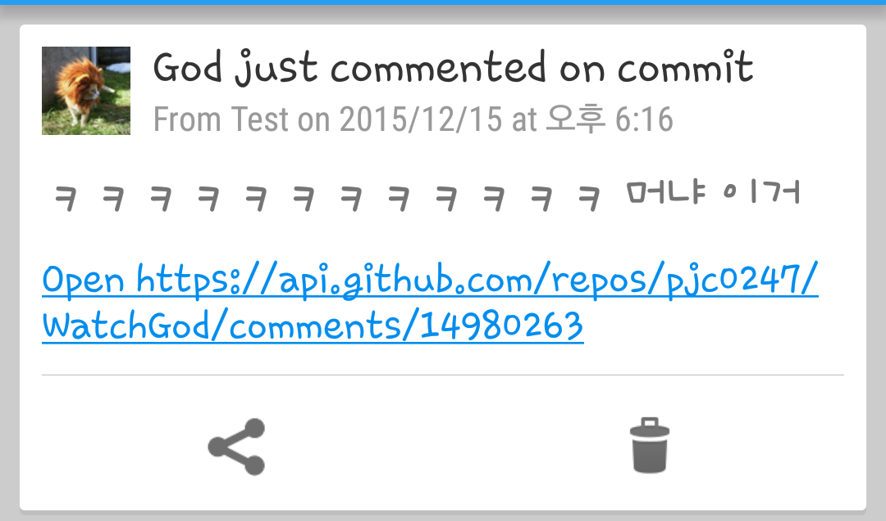

WatchGod
====

<br>


Usage
----
```
gem install watchgod
```
```
watchgod APP_TOKEN USER_TOKEN AUTH_STRING
```
* __APP_TOKEN__ : [PushOver](pushover.net) app token
* __USER_TOKEN__ : [PushOver](pushover.net) user token
* __AUTH_STRING__ : HTTP basic auth string for Github

PushOver에서 __구독 Group__을 만들어 다른 사람들을 가입시키면, 갓현욱의 현재 상황을 다른 사람들과도 함께 공유할 수 있습니다.<br>
이 경우 __UserToken__에 __Group Key__를 입력합니다.

Monitoring Scope
----
* Write comments
  * on Commit
  * on Issue
* Create/Close issues
* Create repos
* Push (Commit)

DAT
----
이 프로그램은 갓-현욱 전용이므로, 모니터링 대상을 변경하는 옵션은 제공되지 않습니다.